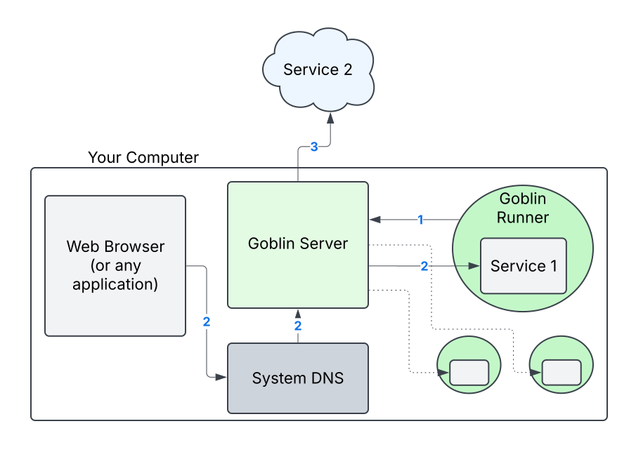

# GOBLIN

**GO** **B**ack-end **L**ocal **I**nfrastructure **N**etwork

Goblin is a local development tool that runs Go applications with DNS-resolved addresses (`service1.goblin`, `backend-app.goblin`, etc.). It works by running applications on private IPs and using a custom DNS resolver and server to access them.

- Access different applications with consistent top-level domains (`*.goblin` by default) when they are running locally or in the cloud
- Don't worry about port conflicts for local applications since they use private IPs
- Use [Go plugins](https://pkg.go.dev/plugin) to run your application without any dependencies


## Install

```shell
go install github.com/calvinmclean/goblin@latest
```


## How does it work?

This consists of two main parts:

1. Goblin server (runs in the background)
    - This provides a DNS server for handling DNS resolution for your applications
    - It also runs an HTTP server that allows an application to request an IP and register a subdomain

2. Goblin Runner
    - This component wraps a compiled Go plugin (`*.so` file). It handles the HTTP request to get an allocated IP and register the subdomain
    - This part is not strictly necessary since an application can be implemented to request an IP on its own. This method allows user applications to exist without any imports or specific handling related to domains and IPs

### Diagram



This diagram shows the general flow of how Goblin works.
1. Goblin Runner loads a Go plugin and registers its subdomain with the Goblin Server to get an allocated private IP
2. Your system's DNS is configured to route requests with Goblins top-level domain (default `.goblin`) to the Goblin Server. This will respond with the IP of a registered Goblin Plugin based on the subdomain
3. If a Goblin Plugin is not running locally with the subdomain, and a fallback route is configured, it is used to proxy requests to a remote destination

This setup allows you to use consistent `*.goblin` host names between applications whether you are running them locally or not. You don't have to worry about port conflicts between them either.


## Getting started

Goblin requires a few system-level changes before it can be used. Eventually the server will handle these steps on its own if it's run with `sudo`, but for now it is manual setup since things generally should not run with `sudo`.

1. Install
    ```shell
    go install github.com/calvinmclean/goblin@latest
    ```

1. Create a custom top-level domain resolver setting at `/etc/resolver/{domain}` (The application's default is `goblin`)
    ```
    nameserver 127.0.0.1
    port 5053
    ```
    - If you create `/etc/resolver/goblin`, all DNS requests for `*.goblin` will use the DNS server at `127.0.0.1:5053`

1. Create IP aliases so your applications can run on private local IPs
    ```shell
    sudo ifconfig lo0 alias 10.0.0.1
    sudo ifconfig lo0 alias 10.0.0.2
    sudo ifconfig lo0 alias 10.0.0.3
    ...
    # create as many as you need
    sudo ifconfig lo0 alias 10.0.0.N
    ```
    - By default, the server expects to be able to use the `10.0.0.0/8` address block
    - These can be removed with:
        ```shell
        sudo ifconfig lo0 -alias 10.0.0.1
        ```

1. Run the server
    ```shell
    goblin server
    ```

1. Implement `Run(ctx context.Context, ipAddress string) error` in your application's `main` package (or use the existing examples in this repository)

1. Run the plugin wrapper:
    ```shell
    goblin run \
      -p ./example-plugins/helloworld/cmd/hello
    ```

1. Use `curl` to make a request to the application using the registered domain name
    ```shell
    curl hello.goblin:8080
    ```

1. Repeat the last 2 steps with different subdomains and/or modules!


## Fallback Routes

When `FallbackRoutes` are configured, Goblin will automatically proxy requests to a remote (or local) destination if there is no local Goblin plugin running with the requested subdomain.

This is useful for microservices development because Goblin can automatically detect if your dependent service is running locally (as a Goblin plugin) and route to a development cloud environment if it's not.

See [`example-fallback-routes.json`](./example-fallback-routes.json) for an example of how this is configured. Pass your routes filename to `goblin server` with `--fallback-routes` or `-r`.


## About plugins

A [Go plugin](https://pkg.go.dev/plugin) is Go code compiled into a shared object (`.so) file that can be loaded and executed by another Go program at runtime. After loading a plugin, Goblin can look up a symbol by name and use type-assertion to use it like any other type. This means that the shared object file needs to provide the type that is expected.

Goblin could work without plugins by providing a wrapper library or `init` function that is imported by another application to handle the IP address allocation. Why didn't I do that instead?
- If Goblin is a library, it would have to be imported into production code as well and controlled with other configurations. Since it exposes control to the program's operation externally, that's not ideal
- A library would likely have stricter implementation requirements and could interfere with normal development
- If the application is a plugin, Goblin has full control of its runtime and doesn't rely on user implementation
- As I add more implementation options that allow running different plugin symbols, this will be a really flexible and non-invasive way to execute a variety of applications
- This is an interesting plugins project and fun to learn about

It's definitely possible that this feature would be added optionally in the future, but for now it's an interesting plugins project.


## Implementing your own application

Goblin will look for and execute one of these symbols (in this order) from the plugin shared-object:

| Type                        | Symbol | Description          |
|-----------------------------|--------|----------------------|
| `func(ctx context.Context, ipAddress string) error` | `Run`   | The simple `Run` function can easily be used by a `main` function in a program's regular operation and also loaded by Goblin |
| `func(ctx context.Context) error` | `Run`   | This option requires the `--env` CLI flag to tell Goblin which env var to use for the IP address. This option is great for existing applications using env vars so `Run` can just call `main()` |


### Example

### Environment Variable

This simple example demonstrates how an existing application can easily become compatible with Goblin if it uses environment variables for the IP address:

```go
package main()

// goblin run --env IP_ADDR
func Run(context.Context) error {
	main()
}

func main() {
	// ...
	ip := os.Getenv("IP_ADDR")
	// ...
	http.ListenAndServe(ip+":8080", handler)
}
```

You can even put `Run` in a new file (`goblin.go`) and add to `.gitignore`!

### Run(ctx context.Context, ipAddress string) error

This Hello World example shows how `Run(ctx context.Context, ipAddress string) error` can easily be implemented into a normal program.

```go
package main

import (
	"context"
	"fmt"
	"log"
	"net/http"
	"sync"
)

func Run(ctx context.Context, ip string) error {
	mux := http.NewServeMux()
	mux.HandleFunc("GET /", func(w http.ResponseWriter, r *http.Request) {
		fmt.Fprintf(w, "Hello, World!\n")
		log.Println("Hello, World!")
	})

	addr := fmt.Sprintf("%s:8080", ip)
	log.Printf("starting server on http://%s", addr)

	server := &http.Server{
		Addr:    addr,
		Handler: mux,
	}

	return server.ListenAndServe()
}

// allow this program to easily be run on its own
func main() {
	err := Run(context.Background(), "127.0.0.1")
	if err != nil {
		log.Fatal(err)
	}
}
```
